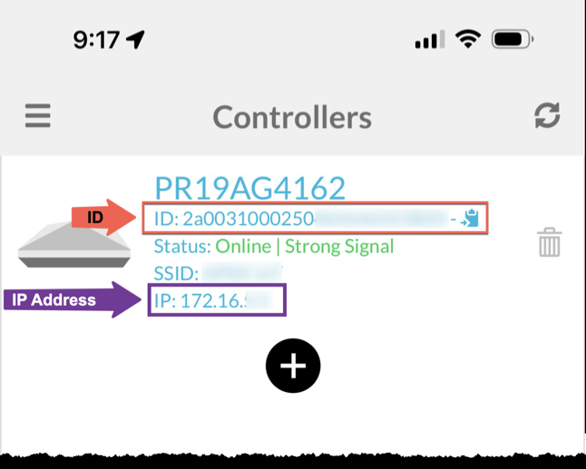
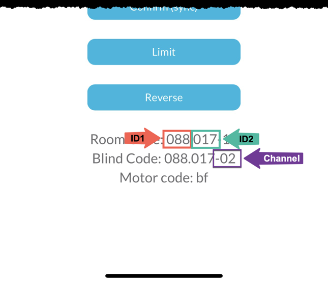

# Homebridge-Neo-Smart-Blinds

Instructions for integrating motorized window blinds controlled by a Neo Smart Controller into Apple HomeKit using Homebridge. These instructions rely on on simple shell scripts executed through the Homebridge Blinds Command plugin that use the controller API to issue up, down, and stop commands to the controller. Connections are unauthenticated but require a unique hash to be submitted with each request to prevent the possibiltiy of duplication.

### Prerequisites

- [Neo Smart Blinds App](https://apps.apple.com/app/id1046912127)
- [Neo Smart Controller](https://neosmartblinds.com/smartcontroller/)
- [Motorized Window Blinds that support the Neo Smart Blind Controller](https://comfortex.com/motorized-shades/)
- Working Homebridge installation
- Working Homebridge Blinds Command plugin

### Setup

1. Install Homebridge &rarr; [Homebridge Setup Instructions](https://github.com/homebridge/homebridge/wiki#homebridge-setup-instructions)

2. Install Homebridge Blinds Command plugin &rarr; [Plugin Installation](https://github.com/hjdhjd/homebridge-blinds-cmd#installation)

3. Locate the _ID_, _ID1_, _ID2_, _Channel_, and _Controller IP Address_ using the mobile app.

	<ins>__ID and Controller IP Address__</ins>

	_Menu &rarr; Smart Controllers &rarr; [Smart Controller] &rarr; ID &rarr; IP_

	

	_Example:_

	```
	id="2a0031000250xxxxxxxxxxxx"
	controller="172.16.5.x"
	```

	<ins>__ID1, ID2, and Channel__</ins>

	_Menu &rarr; Your Rooms &rarr; [Room] &rarr; [Blind] &rarr; Room Code &rarr; Blind Code_

	

	_Example:_

	```
	id1="088"
	id2="017"
	channel="02"
	```

4. Modify UP, DOWN, and STOP scripts

	- See example scripts

5. Update Homebridge config.json

	- See example config.json

6. Restart Homebridge

### Troubleshooting

The included __```smart-blinds-test.py```__ script can be used to troubleshoot and test various blind settings. Please update with the approprite _ID_, _ID1_, _ID2_, _Channel_, and _Controller IP Address_ according to your configuration.

### References

Neo Controller API

- [Open HTTP Protocol v1.3 ](api/Open%20Local%20HTTP%20Protocol%20V1.3.pdf)
- [Open TCP Protocol v1.5 ](api/Open%20TCP%20Protocol%20V1.5.pdf)

### Additional Information

Here is where I purchased my motorized window blinds, solar chargers, and remotes.

- [Comfortex/Simplicity Motorized Blinds](https://northsolarscreen.com/)
- [Rollerhouse 8.4V Solar Charger](https://www.amazon.com/gp/product/B07BR1S6B8/ref=ppx_yo_dt_b_search_asin_title?ie=UTF8&psc=1)
- [Rollerhouse 5 Channel Remote](https://www.amazon.com/gp/product/B077P7YWQH/ref=ppx_yo_dt_b_search_asin_title?ie=UTF8&psc=1)


### Disclaimer

These are proof of concept scripts. Use at your own risk.


